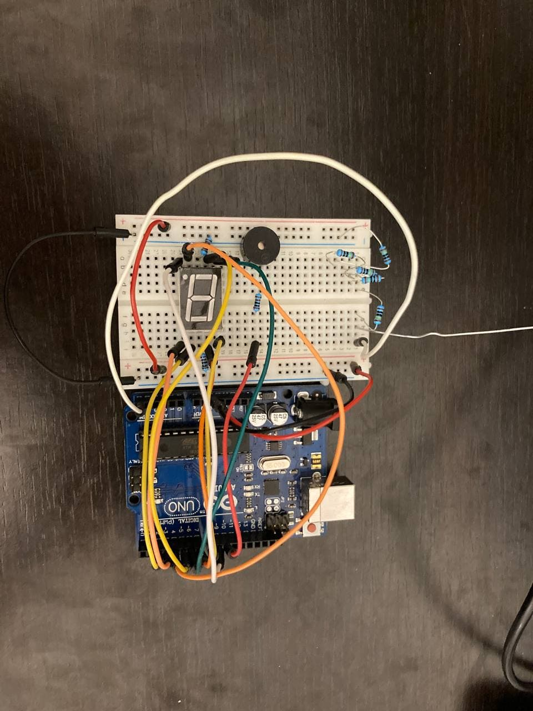

# Introduction To Robotics

Come see my robots! - Robotics projects completed during the Introduction To Robotics course @ CS, UNIBUC

 

If you've yet to read Asimov's Robots series, I highly recommend it. 

#### Homework #0
Consisted of installing Arduino IDE and setting up this very repository. Hi!

#### Homework #1

##### Task Requirements

Use 3 potentiometers to digitally control a RGB led.

##### Picture

##### Video

#### Homework #2

##### Task Requirements

Create a traffic light simulator with both car and pedestrian lights, as well as a buzzer. On a button press, the system will go through the following states:

 - State 1 (default, reinstated after state 4 ends): green light for cars,red  light  for  people,  no  sounds.   Duration:  indefinite,  changed  bypressing the button.
 - State 2 (initiated by counting down 10 seconds after a button press):the  light  should  be  yellow  for  cars,  red  for  people  and  no  sounds.Duration:  3 seconds.
 - State 3 (iniated after state 2 ends): red for cars, green for people anda beeping sound from the buzzer at a constant interval.  Duration:10 seconds.
 - State 4 (initiated after state 3 ends): red for cars,blinking green for people and a beeping sound from the buzzer, at a constant interval,  faster than the beeping in state 3. This state should last 5 seconds.

Subsequent button presses should not reset the system until after it is idling again.

Write the code without using the `delay()` function!

##### Picture

##### Video

#### Homework #3

##### Task Requirements

Create an Electromagnetic Field Detector (or ghost detector if you may) that shows data on a 7-segment display, as well as buzzes, when approaching electromagnetic fields.

##### Picture

##### Video

