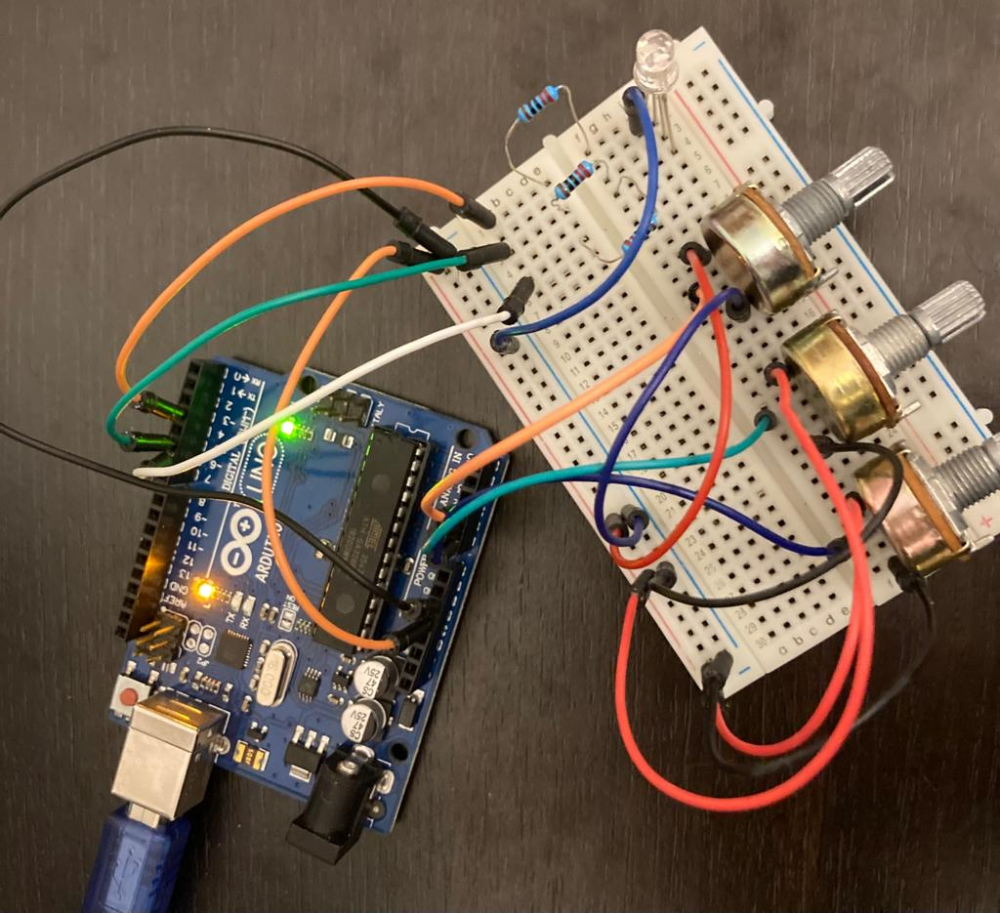

# IntroductionToRobotics

Come see my robots! - Robotics projects completed during the Introduction To Robotics course @ CS, UNIBUC

 

If you've yet to read Asimov's Robots series, I highly recommend it. 

#### Homework #0
Consisted of installing Arduino IDE and setting up this very repository. Hi!

#### Homework #1

##### Task Requirements

Use 3 potentiometers to digitally control a RGB led.

##### Picture

##### Video

